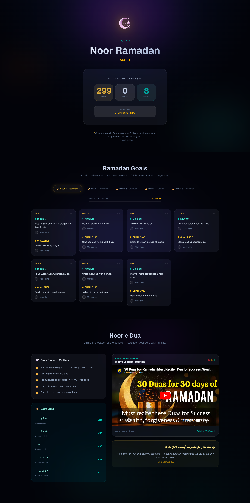

# Noor Ramadan 2026 — Spiritual Tracker

> *"Small consistent acts are more beloved to Allah than occasional large ones."*

A serene digital sanctuary for the blessed month — track your **Worships**, nurture your soul, and walk through Ramadan with intention, one day at a time.

**[Live Demo →](https://ramadan-tracker-sand.vercel.app/)**




## Features

### Ramadan Countdown
Real-time countdown to Ramadan or live progress tracking during the month, showing days remaining, current day out of 30, and overall completion percentage.

### Daily Goal Tracker
30 curated spiritual goals organized across 5 themed weeks, each with a **Mission** and a **Challenge** for the day. Progress is saved locally in your browser so your journey persists across sessions.

| Week | Theme |
|------|-------|
| Week 1 | Repentance |
| Week 2 | Devotion |
| Week 3 | Gratitude |
| Week 4 | Charity |
| Week 5 | Reflection |

### Dua Corner
A dedicated spiritual reflection space featuring:
- Personal duas (supplications) close to the heart
- Daily Dhikr with Arabic text, Latin transliteration, and recitation counts
- Curated spiritual video content


## Tech Stack

| Layer | Technology |
|-------|-----------|
| Framework | Next.js 15 (App Router) |
| Language | TypeScript |
| Styling | Tailwind CSS v4 |
| UI Components | shadcn/ui |
| Animations | Framer Motion |
| Icons | Lucide React |
| Date Handling | date-fns |
| Persistence | js-cookie |
| Fonts | Geist · EB Garamond · Amiri (Arabic) |


## Project Structure

```
src/
├── app/                    # Next.js App Router
│   ├── (home)/
│   │   ├── page.tsx        # Main page
│   │   └── layout.tsx
│   ├── layout.tsx          # Root layout & metadata
│   └── globals.css         # Global styles & design tokens
├── components/
│   ├── sections/
│   │   ├── CountDown.tsx   # Ramadan countdown / progress
│   │   ├── RamadanGoals.tsx# Weekly goal tracker
│   │   └── DuaCorner.tsx   # Duas, Dhikr & video
│   └── ui/                 # shadcn/ui base components
├── data/
│   ├── goals.json          # 30 daily Ramadan goals
│   └── ibadat.ts           # Duas and Dhikr content
├── services/
│   ├── ramadan.service.ts          # Countdown API integration
│   ├── ramadanGoalsLogic.service.ts# Goal state & cookie logic
│   └── dailyIbadah.service.ts      # 30-day Ibadah structure
├── types/
│   └── ramadan.types.ts    # TypeScript interfaces
└── utils/
    └── countdown.ts        # Countdown calculation helpers
```

## Design System

The UI is built around a dark, calming aesthetic inspired by the night sky during Ramadan.

**Color Palette**

| Name | Value | Use |
|------|-------|-----|
| Gold | `oklch(0.78 0.14 85)` | Primary accent |
| Teal | `oklch(0.65 0.12 190)` | Secondary accent |
| Deep Navy | `oklch(0.10 0.02 265)` | Background |
| Rose | `oklch(0.70 0.14 10)` | Tertiary accent |

**UI Highlights**
- Glassmorphism cards with backdrop blur
- Smooth entrance animations (fade-up, float)
- Shimmer and glow-pulse effects on interactive elements
- Fully responsive layout


## Scripts

```bash
npm run dev      # Start development server
npm run build    # Build for production
npm run start    # Start production server
npm run lint     # Run ESLint
```


## Acknowledgements

- Ramadan countdown data powered by [ramadan.zakiego.com](https://ramadan.zakiego.com)
- Arabic typography via the [Amiri](https://fonts.google.com/specimen/Amiri) font family
- UI components from [shadcn/ui](https://ui.shadcn.com)


*Ramadan Mubarak. May Allah accept your worship and grant you consistency throughout the blessed month.*
